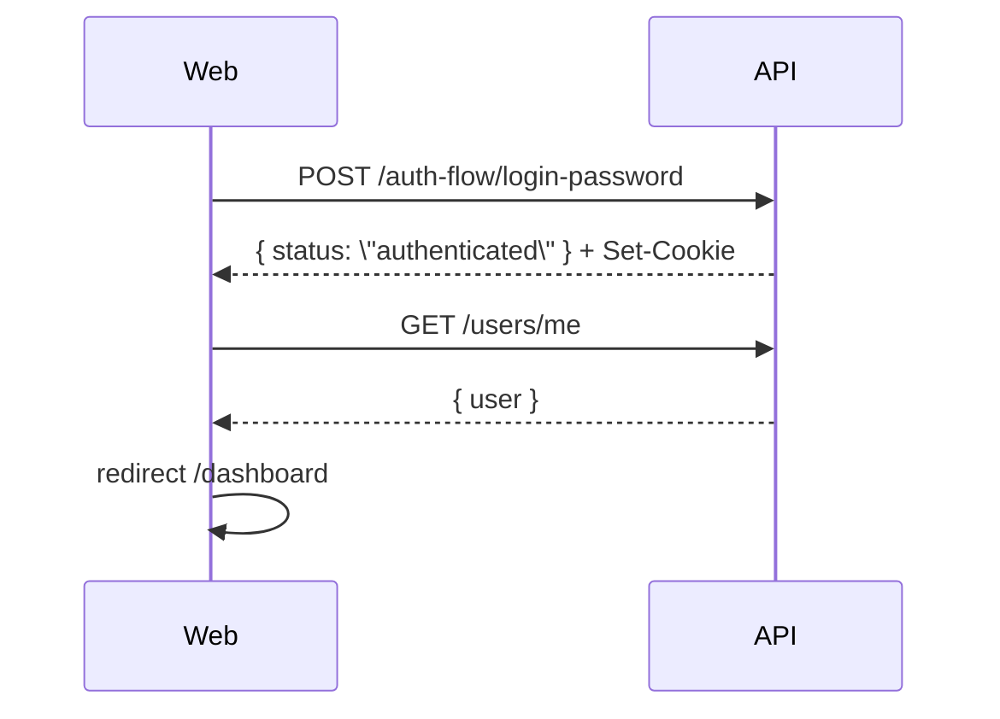
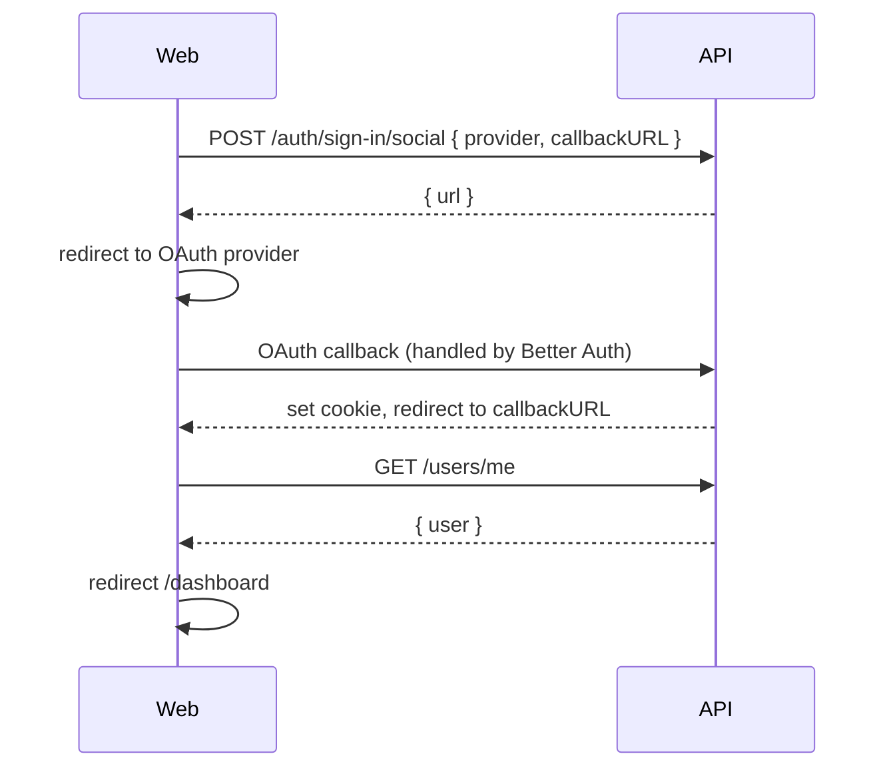

# Auth (web) — developer guide

This folder contains the client-side state and hooks used by the auth pages. The network/API surface is centralized in `apps/web/src/shared/lib/auth.ts`.

## Source of truth (contracts)
- **Shared types**: `packages/contracts/src/auth.ts`

## Frontend pages (Next.js routes)
- **Login**: `apps/web/src/app/(site)/auth/login/page.tsx`
- **Signup**: `apps/web/src/app/(site)/auth/signup/page.tsx`
- **OAuth callback**: `apps/web/src/app/(site)/auth/callback/page.tsx`

## Backend endpoints used by the web app
- **Password login/signup (session-first + OTP)** (`apps/api/src/auth/auth.controller.ts`)
  - `POST /api/v1/auth-flow/signup-password`
  - `POST /api/v1/auth-flow/login-password`
  - `POST /api/v1/auth-flow/otp/send`
  - `POST /api/v1/auth-flow/otp/verify`
- **OAuth** (Better Auth)
  - `POST /api/v1/auth/sign-in/social` → returns redirect URL
  - Callback handled by Better Auth, redirects to frontend

## Flow sketches

### Password login

### OAuth login

## Where to edit things
- **API calls / auth client**: `apps/web/src/shared/lib/auth.ts`
- **Token storage + auth state**: `apps/web/src/shared/auth/stores/auth-context.tsx`
