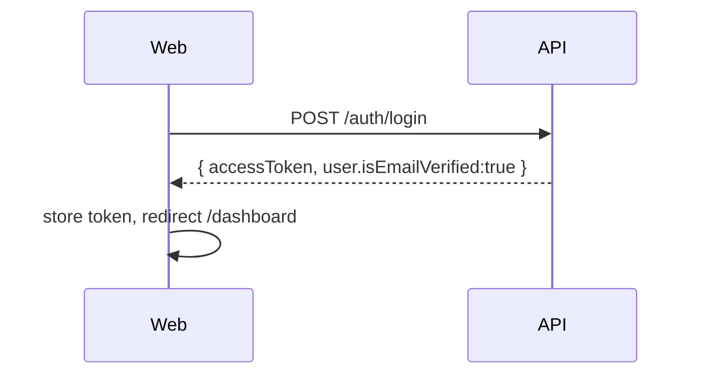
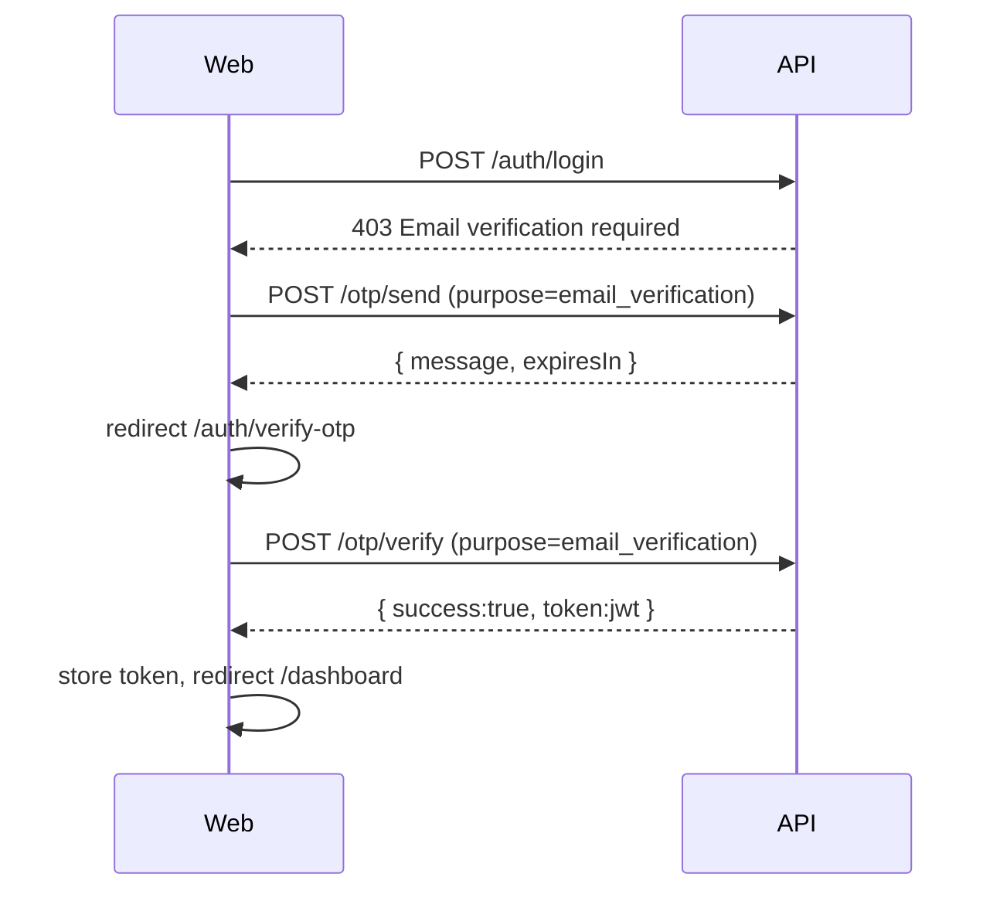
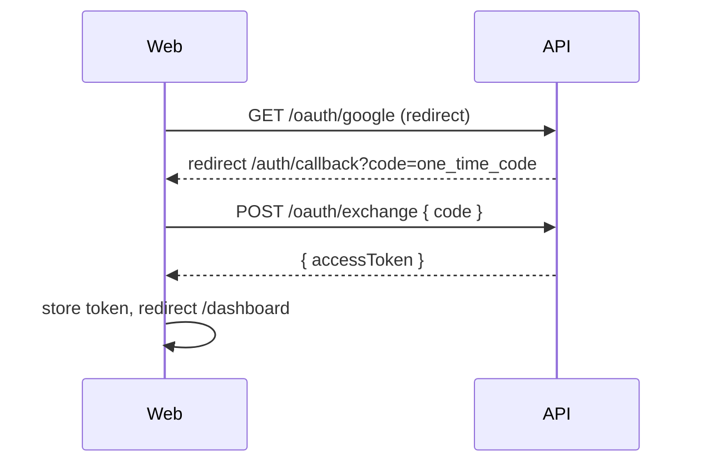
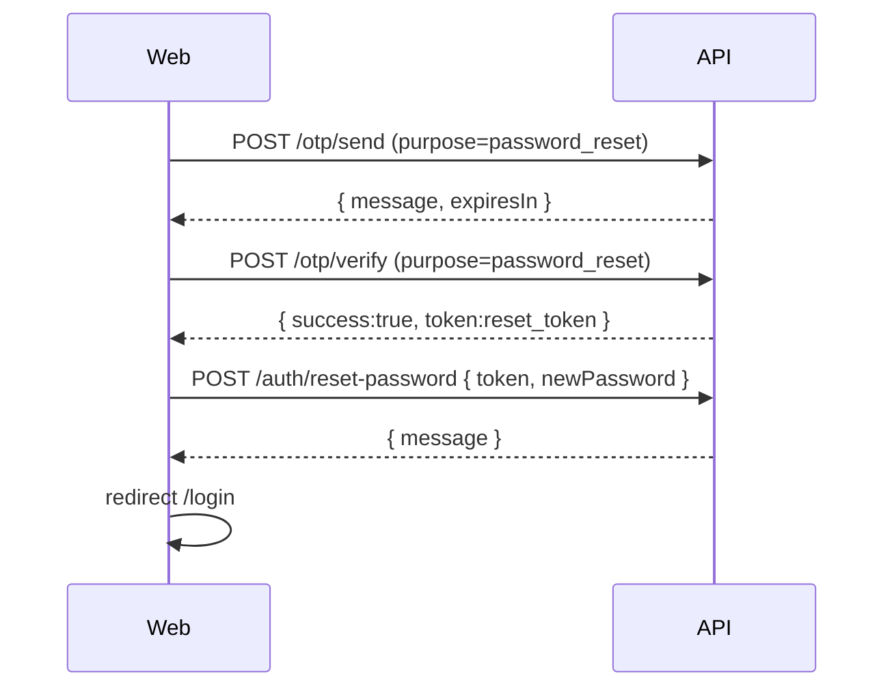

# Auth (web) — developer guide

This folder contains the client-side state and hooks used by the auth pages. The network/API surface is centralized in `apps/web/src/shared/lib/auth.ts`.

## Source of truth (contracts)
- **Shared types**: `packages/contracts/src/auth.ts`
- **Backend DTO validation**:
  - `apps/api/src/otp/dto/send-otp.dto.ts`
  - `apps/api/src/otp/dto/verify-otp.dto.ts`

## Frontend pages (Next.js routes)
- **Login**: `apps/web/src/app/(site)/auth/login/page.tsx`
- **Signup**: `apps/web/src/app/(site)/auth/signup/page.tsx`
- **Verify OTP**: `apps/web/src/app/(site)/auth/verify-otp/page.tsx`
- **OAuth callback**: `apps/web/src/app/(site)/auth/callback/page.tsx`
- **Forgot password**: `apps/web/src/app/(site)/auth/forgot-password/page.tsx`

## Backend endpoints used by the web app
- **Password login/signup** (`apps/api/src/auth/auth.controller.ts`)
  - `POST /api/v1/auth/signup`
  - `POST /api/v1/auth/login` (returns **403** if `isEmailVerified === false`)
  - `POST /api/v1/auth/reset-password`
- **OAuth** (`apps/api/src/oauth/oauth.controller.ts`)
  - `GET /api/v1/oauth/google` → redirects to `GET /api/v1/oauth/google/callback`
  - `GET /api/v1/oauth/github` → redirects to `GET /api/v1/oauth/github/callback`
  - callback redirects to `GET /auth/callback?code=...`
- **OTP** (`apps/api/src/otp/otp.controller.ts`)
  - `POST /api/v1/otp/send` `{ email, purpose, captchaToken? }`
  - `POST /api/v1/otp/verify` `{ email, code, purpose }`
  - `POST /api/v1/otp/resend` `{ email, purpose }`

## Key behavior: email verification is required
- After **signup**, the UI sends an `email_verification` OTP and redirects to `/auth/verify-otp`.
- After **password login**, the backend returns **403** if the user is unverified; the UI then sends an `email_verification` OTP and redirects to `/auth/verify-otp`.
- On `/dashboard/*`, `ProtectedDashboardGuard` checks `GET /users/me`; if unverified, it redirects to `/auth/verify-otp`.

## Flow sketches

### Password login (verified)

### Password login (unverified → OTP verify)

### OAuth login

### Forgot password

## Where to edit things
- **API calls / auth client**: `apps/web/src/shared/lib/auth.ts`
- **Token storage + auth state**: `apps/web/src/shared/auth/stores/auth-context.tsx`
- **OTP cooldown / UI**: `apps/web/src/shared/auth/hooks/useOtpFlow.ts`, `apps/web/src/shared/auth/utils/otp.ts`
- **Backend email verification + OTP token issuance**: `apps/api/src/otp/otp.service.ts`
- **Backend login policy (403 when unverified)**: `apps/api/src/auth/auth.service.ts`
