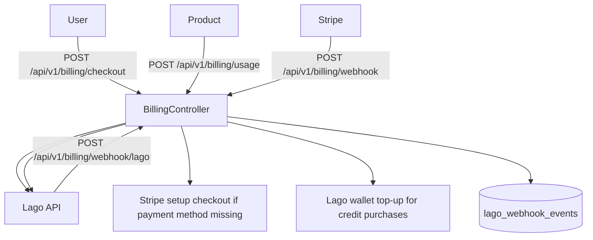

# Billing System Overview

Billing is now **Lago-first**:
- Lago handles subscriptions, invoices, usage metering, and webhook idempotency.
- Stripe is used for payment methods, billing portal, and one-time credit purchases.

## High-level flow

## Main components

- `apps/api/src/billing/lago.service.ts`
  - Lago API wrapper for customers, subscriptions, invoices, usage events, wallets.
- `apps/api/src/billing/lago-webhook.handler.ts`
  - Handles Lago webhook events with DB idempotency.
- `apps/api/src/billing/billing.service.ts`
  - Billing orchestration layer (Lago-first, rollout-gated).
- `apps/api/src/billing/stripe.service.ts`
  - Stripe helper for customer, setup/payment checkout, payment methods, portal.
- `apps/api/src/entitlements/entitlements.service.ts`
  - Entitlement checks and usage logic backed by Lago usage reads/events.

## Key environment variables

- `LAGO_API_URL`
- `LAGO_API_KEY`
- `LAGO_WEBHOOK_SECRET`
- `LAGO_ROLLOUT_PERCENT`
- `STRIPE_SECRET_KEY`
- `STRIPE_WEBHOOK_SECRET`
