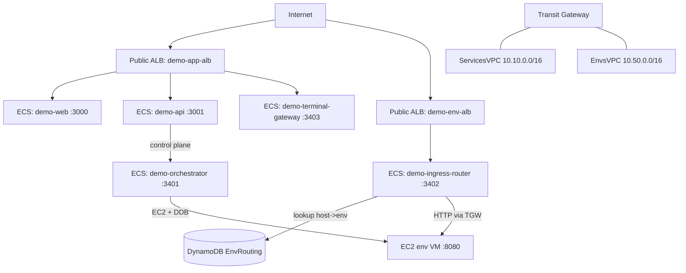

# Demo platform (AWS) — Overview

This demo stack lives in `infra/demo/` and is intended to model a real platform with:

- Web: `pytholit.dev` (or `dev.pytholit.dev` when `app_domain_prefix=dev`)
- API: `api.pytholit.dev`
- Terminal gateway: `terminal.pytholit.dev`
- Per-environment URLs: `env-{envId}.dev.pytholit.dev` and `env-{envId}.prod.pytholit.dev`

## High-level architecture

## What gets provisioned

From `infra/demo/main.tf`:

- **Networking**:
  - ServicesVPC `10.10.0.0/16` (`infra/demo/servicesvpc/`)
  - EnvsVPC `10.50.0.0/16` (`infra/demo/envsvpc/`)
  - Transit Gateway + private routes (`infra/demo/tgw/`)
- **Security groups**: ALBs, ECS services, env VMs (`infra/demo/security/`)
- **ECS/Fargate** cluster + services (`infra/demo/ecs/`)
  - `demo-web` (3000)
  - `demo-api` (3001)
  - `demo-ingress-router` (3402)
  - `demo-terminal-gateway` (3403)
  - `demo-orchestrator` (3401)
- **RDS Postgres** (dev + prod instances) (`infra/demo/postgres/`)
- **DynamoDB**: `EnvRouting` table (`infra/demo/dynamodb/`)
- **Env VM substrate**: Launch Template for Ubuntu 22.04 with Docker/Compose (`infra/demo/compute/`)
- **Optional public ALBs**:
  - `demo-app-alb` (routes app/api/terminal by Host header) (`infra/demo/alb_app/`)
  - `demo-env-alb` (routes env wildcard traffic to ingress-router) (`infra/demo/alb_env/`)
- **Optional ACM/DNS outputs** (`infra/demo/dns_acm/`)
  - Emits the DNS records you must create externally (GoDaddy-managed zone by default).

## Important toggles

Terraform variables (`infra/demo/variables.tf`):

- `enable_alb`: creates the public ALBs when `true`
- `enable_dns_acm`: creates ACM certificates and emits DNS record requirements when `true`
- `app_domain_prefix`: e.g. `"dev"` makes app/api/terminal use `dev.pytholit.dev`
- `api_database_env`: which Postgres instance API connects to (`dev|prod`)

See `docs/demo/terraform.md` for the full list.

